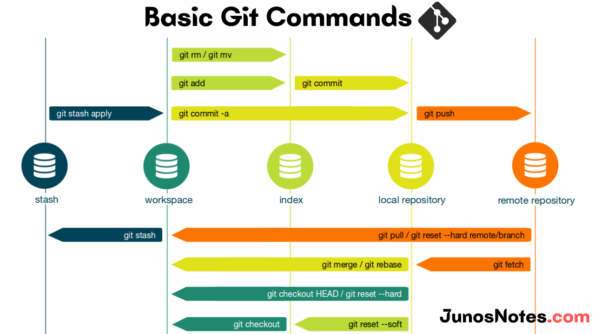

# Git and GitHub notes/cheatsheet

## Git Commands


## Git Commands

### Initialise git repo
```git init```

### Add files to staging
```git add file.txt```

### Commit files to repo
```git commit -m "meaningfull message"```

### Add remote repo
```git add remote origin https://github.com/account/repo.git```

### Push local repo to remote repo
```git push -u origin main```
